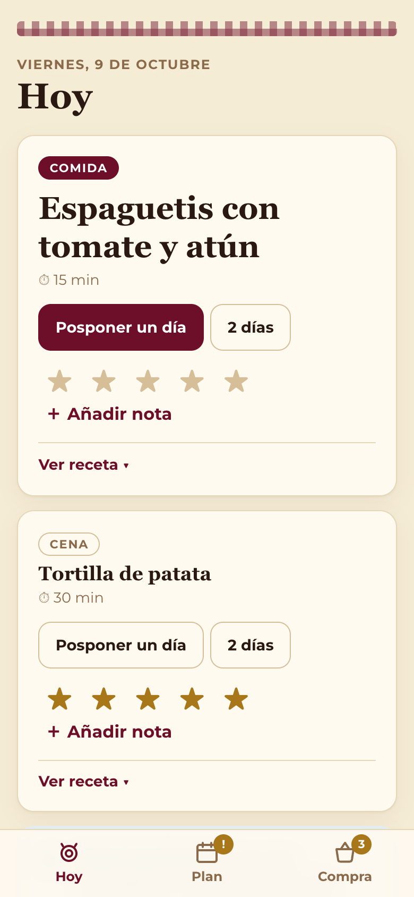
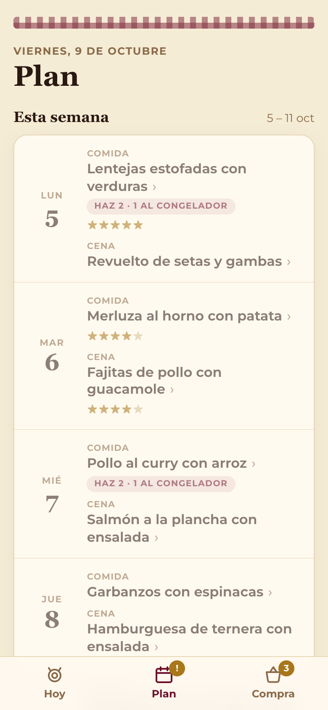
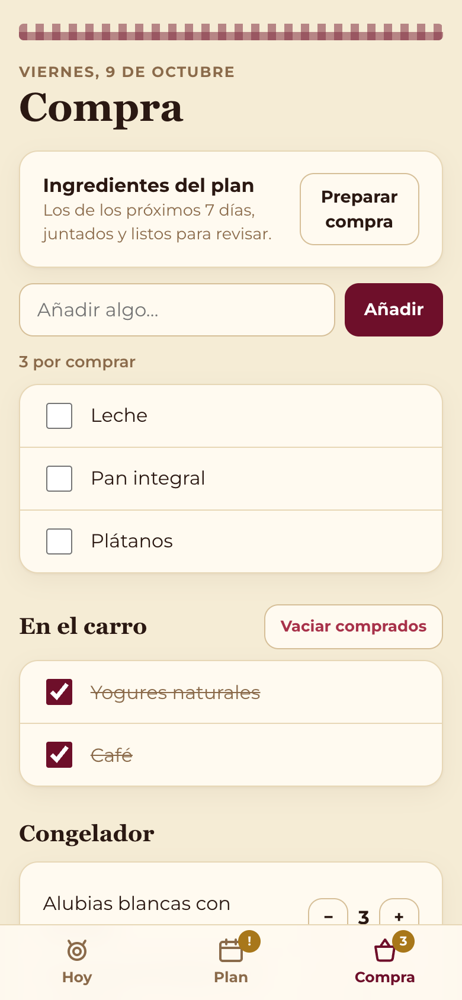
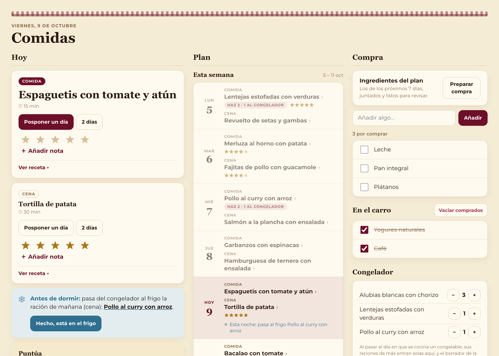

# comidas

Panel de cocina de una pantalla (móvil primero; en escritorio, tres columnas) sobre **Mealie** y **Home Assistant**:
qué se come hoy, qué hay que descongelar, el plan de la semana y la lista de la compra.

- **Mealie** es la fuente de verdad del plan, las recetas y las valoraciones.
- La **lista de la compra** es una entidad `todo` de Home Assistant (la misma que se ve en la app de HA o en iOS).
- El estado propio del panel (borrador, descongelado, compra hecha, inventario del congelador) vive en una SQLite
  pequeña: `/var/lib/comidas/comidas.db`.

Inspirado en [Supper-Board](https://github.com/weezerhunter/Supper-Board).

<p>
  
  
  
</p>



<sub>Capturas con datos de ejemplo (`demo/`).</sub>

## Qué hace

**Hoy**
- La comida y la cena del plan de Mealie. La siguiente va destacada (hasta las 16:00, la comida; después, la cena),
  con tiempo y foto si la receta la tiene.
- **Ver receta** (plegada hasta que se abre): raciones, tiempos, ingredientes y pasos para ir tachando (se recuerda
  en el navegador ese día) y "Mantener la pantalla encendida" (Wake Lock).
- **Posponer un día o 2 días**: corre ese plato y todos los posteriores del mismo tipo (comida o cena), con Deshacer.
- **Valorar (★)** con el usuario del token. El bloque **Puntúa** recuerda lo comido en los últimos 7 días que sigue
  sin valorar.
- **Notas** de "cómo salió" ("con menos sal"), guardadas como comentarios de la receta en Mealie. Se ven al abrir la
  receta y debajo de cada plato del borrador.
- **Descongelar**: la víspera de una ración del congelador, aviso "Antes de dormir, pásalo al frigo" con un botón
  **"Hecho, está en el frigo"**. Si se pospone el plato, la marca se mueve con él.

**Plan**
- **Esta semana** y **Semana que viene**, una fila por día de lunes a domingo. Tocar un plato despliega su receta.
- El borrador semanal va dentro de su semana (ver abajo).

**Compra**
- La lista de HA: leer, añadir, marcar y vaciar lo comprado.
- **Preparar compra**: junta los ingredientes de los platos aprobados de los próximos 7 días ("Atún (7 latas)"),
  con vista previa y casillas. Los básicos de despensa, lo opcional y lo que ya está pendiente salen desmarcados.
  Los platos ya pasados a la compra no se vuelven a proponer.
- **Congelador**: inventario de raciones congeladas, con − / + para corregir a mano.

### Congelador

Las recetas con la etiqueta `congelable` se cocinan para sus raciones de Mealie (2, 4…). Al pasar el día, las de
más (raciones − 1) entran al inventario del congelador, y el borrador de la semana siguiente las coloca antes de
sortear el resto. Lo que sale del congelador no entra en "Preparar compra". Las recetas no congelables se cocinan
justas.

### Borrador semanal

Los **domingos a las 9:00** (`comidas-borrador.timer`) se genera el plan de lunes a domingo de la semana siguiente
como **borrador**, guardado en la SQLite del panel. Mealie no se toca hasta que se aprueba. En la pestaña Plan:
**↻ Cambiar** sortea otra receta para ese hueco, **Aprobar** crea los platos en Mealie, **Regenerar** rehace el
borrador y **Descartar** lo borra (lo aprobado nunca se toca).

- Huecos: lunes a jueves comida y cena, viernes comida, sábado libre, domingo comida y cena (11 platos).
- Cada hueco solo saca recetas de su categoría de Mealie: `comida` a mediodía, `cena` por la noche (con las dos o
  sin ninguna, valen para ambos).
- Sorteo ponderado por valoración (peso = estrellas²; sin valorar o 0 = 3★), sin repetir recetas de los últimos
  14 días.
- Variedad: mínimo 2 de pescado y 2 de legumbres; máximo 3 por proteína (el pollo, sin límite), 2 de pasta y 2 de
  arroz.

Todo esto se ajusta en [`panel/config.py`](panel/config.py).

### Avisos

Por la app de Home Assistant del móvil (`notify.<HA_NOTIFY>`); tocarlos abre el panel (`PANEL_URL`):
- **21:00 cada noche** (`comidas-avisos.timer`): qué pasar al frigo, si mañana hay una ración del congelador sin
  marcar.
- **Domingo, al generarse el borrador**: cuántos platos hay que revisar.

Sin `HA_NOTIFY` no se avisa. Un aviso que falla solo deja rastro en el journal.

## Arquitectura

```
navegador ──▶ proxy inverso (TLS) ──▶ :8000  panel FastAPI  (/opt/comidas, usuario www-data)
                                         ├─▶ Mealie: plan, recetas, valoraciones, notas
                                         ├─▶ Home Assistant: lista de la compra (todo.*) y avisos (notify.*)
                                         └─▶ /var/lib/comidas/comidas.db  (SQLite)
```

Los tokens de Mealie y HA solo viven en el `.env` del servidor y nunca llegan al navegador. Las fotos de las
recetas las carga el navegador directamente de `MEALIE_PUBLIC_URL` (los medios de Mealie son públicos).

| Fichero | Qué es |
|---|---|
| `panel/app.py` | API del panel y servidor del `index.html` |
| `panel/mealie.py` | Cliente de la API de Mealie + lógica pura (posponer, etiquetas) |
| `panel/ha.py` | Lista de la compra vía servicios `todo.*` de HA y avisos vía `notify.*` |
| `panel/avisos.py` | Avisos: descongelar (21:00) y borrador nuevo |
| `panel/db.py` | SQLite del panel: borrador, descongelado, compra hecha e inventario del congelador |
| `panel/ingredientes.py` | Parser de ingredientes en castellano y agregado entre recetas |
| `panel/generar.py`, `panel/config.py` | Borrador semanal (sorteo, cambiar, aprobar) y su configuración |
| `panel/static/index.html` | Todo el frontend (HTML/CSS/JS sin dependencias) |
| `deploy/` | Unidades systemd (panel, borrador, avisos) y `pull.sh` para desplegar por git pull |
| `tests/` | Tests contra Mealie y HA simulados |

### API

| Método y ruta | Qué hace |
|---|---|
| `GET /api/plan` | Hoy, por valorar, descongelar, las dos semanas (con el borrador) y el congelador |
| `POST /api/plan/{id}/posponer` `{dias}` | Corre esa entrada y las posteriores del mismo tipo; deshacer = días en negativo |
| `POST /api/descongelado` `{fecha, tipo, hecho}` | "Hecho, está en el frigo" (o deshacer) |
| `POST /api/congelador/{receta_id}` `{delta}` | Corrección a mano del inventario |
| `GET /api/recetas/{slug}` | Receta para cocinar, con sus notas |
| `POST /api/recetas/{slug}/valoracion` `{estrellas}` | Valoración |
| `POST /api/recetas/{slug}/nota` `{texto}` | Nota de "cómo salió" |
| `POST /api/borrador/generar` `{lunes?}` | Genera o regenera el borrador |
| `POST /api/borrador/{id}/cambiar` | Sortea otra receta para ese plato |
| `POST /api/borrador/aprobar`, `DELETE /api/borrador` | Aprueba (crea en Mealie) o descarta el borrador |
| `GET/POST /api/compra`, `PUT /api/compra/{uid}` | Leer, añadir y marcar en la lista de HA |
| `GET/POST /api/compra/plan` | Vista previa de "Preparar compra" y añadir lo marcado |
| `DELETE /api/compra/comprados` | Vaciar lo comprado |

Documentación interactiva en `/api/docs`.

## Desarrollo

```bash
python3 -m venv .venv && .venv/bin/pip install -e '.[dev]'
.venv/bin/pytest -q
```

Para probar el panel sin Mealie ni Home Assistant, con recetas inventadas, en http://127.0.0.1:8765:

```bash
.venv/bin/python -m demo.servidor
```

Con la demo en marcha, `node demo/capturas.mjs docs/capturas http://127.0.0.1:8765` rehace las capturas de móvil
(necesita Chrome).

## Despliegue

Pensado para correr en la misma máquina (o contenedor) que Mealie, con Debian/Ubuntu y systemd.

1. **Tokens**: Mealie (Perfil → API Tokens) y HA (Perfil → Seguridad → token de larga duración).
2. **Checkout + .env** (como root):
   ```bash
   apt-get install -y git python3-venv
   git clone <url-de-este-repo> /opt/comidas
   cp /opt/comidas/.env.example /opt/comidas/.env   # rellenar
   /opt/comidas/deploy/pull.sh
   ```
   `pull.sh` crea el venv, instala las unidades de systemd (panel en `:8000`, timers del borrador y de los avisos)
   y reinicia el servicio.
3. **Proxy inverso** con TLS delante de `:8000` (Caddy, nginx…). El panel no tiene autenticación: déjalo solo en
   la red local o detrás de una VPN.

Para actualizar, `git pull` + reinicio en un paso:

```bash
ssh <servidor> /opt/comidas/deploy/pull.sh
```

Generar el borrador a mano (o simular sin escribir con `--simular`):

```bash
sudo -u www-data bash -c 'set -a; . /opt/comidas/.env; cd /opt/comidas && .venv/bin/python -m panel.generar --lunes 2026-10-12'
```

## Licencia

[MIT](LICENSE).
